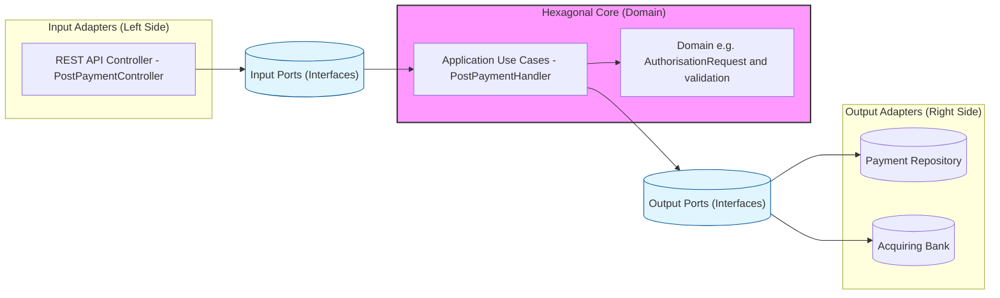

# Notes from technical test

## Design Choices
| Aspect             | Comments                                                                                                                                                                                                                                                                                                                                                                                                                                                                                                                                                                                                                                                                                       |
|--------------------|------------------------------------------------------------------------------------------------------------------------------------------------------------------------------------------------------------------------------------------------------------------------------------------------------------------------------------------------------------------------------------------------------------------------------------------------------------------------------------------------------------------------------------------------------------------------------------------------------------------------------------------------------------------------------------------------|
| Architecture       | The software is built using paired-down hexagonal (ports and adapters / clean / layered)  architecture. Each use case has a technology independent handler that is tested using sociable unit tests.  The presentation folder represents the entry point controllers which are tested using integration tests. The separation of technology independent handlers allows for super simple behaviour driven  tests not constrained by technical matters.                                                                                                                                                                                                                                         |
| Observability      | The solution has been hooked up with application insights (given no other direction) which gives  us automatic visibility of dependencies and requests. This is supplemented by a (DDD) domain probe  to give additional visibility to rejections.                                                                                                                                                                                                                                                                                                                                                                                                                                             |
| Security           | Given that several high profile attacks using a brute force and social engineering element have been able to successfully recover PCI account data from customers using only the last 4 PAN digits, I have taken  the view these should not appear in the logs, thus the choice to add a separate header in the W3C  baggage header. Detailed error pages will be                                                                                                                                                                                                                                                                                                                              |
| Concurrency        | Without implementing a feature not in the specification, I don't believe the design/contract can work for a  concurrent transaction scenario. I have taken the view that this is such a basic requirement that it should  be implemented in the simplest way possible. I have added an deduplication store that is assumed to offer  self deleting records via a TTL, and optimistic concurrency.  I am aware this is open to criticism for  implementing functionality beyond the specification. In a real world scenario I would attempt to influence  the client contract to include a natural idempotency key as this would allow us to no-op and instead do a "get" lookup on duplicates. |
| Resiliency         | The acquiring party (as simulated) has no capability to void transactions and the availability of a service bus is not socialised in the requirements. Thus I have only implemented basic sub-second retries using Polly. This means there is an unsupported edge case (flaw/bug) in the solution where a payment  has been made but it has not been saved. In a real world scenario I would seek business opinion on this.                                                                                                                                                                                                                                                                    |
| Performance        | The solution contains no performance tests. Given there are no non-functional requirements this is purely a technical matter and can be added at a later time. I would usually implement using something like NBomber.                                                                                                                                                                                                                                                                                                                                                                                                                                                                         |
| Rest Compliance    | I have modelled a Payment as a rest container and therefore used POST to create new payments. This is consistent with the existing routes defined in the repository provided.                                                                                                                                                                                                                                                                                                                                                                                                                                                                                                                  |
| Solution Viability | There are no out of process or end to end tests. This is a deliberate choice, and are replaced by a liveness health check api route. This would be called by orchestration monitoring e.g. Kubernetes liveness check, docker health check or environment monitoring software. The only matters that an out of process component test would cover  are dependency injection (composite root) failures.                                                                                                                                                                                                                                                                                          |
| SOLID              | Classes are separated into clear concerns for example using ValueTypes for validation keeping the validation as close to the use case as possible, decorators for cross cutting concerns (open closed), and dependency injection for design by contract.                                                                                                                                                                                                                                                                                                                                                                                                                                       |

## Architecture
I have included a design of the process payment use case for visualisation:

## Assumptions
1. The purpose is a payment gateway and therefore the testing style should be robust
2. Unused fields should be removed to comply with PCI DSS Requirements 2 and 6
3. It is not acceptable to leave the solution as not supporting concurrent transactions
4. There are no NFRs that require performance testing 