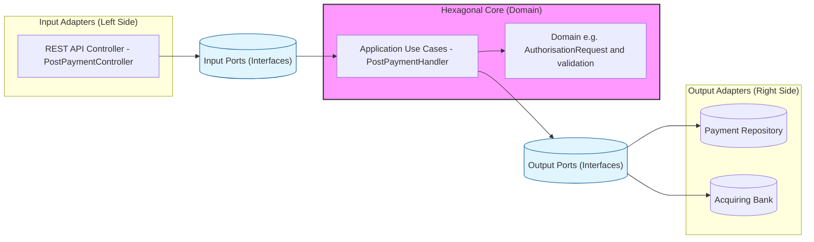

# Notes from technical test|

## Architecture
Post process:

## Design Decisions

- **Functional Testing** - I have chosen to use a hexagonal architecture for the core domain to allow simple unit tests to be built. The
  Get/PostPaymentHandler is tested with unit tests and the Get/PostPaymentController is tested with integration 
  tests. This limits leakage which I believe makes the code and tests easier to understand. I have used sociable unit 
  tests to increase the test confidence and ability to refactor. I have extensively restructured the folder structure 
  which was allowed in the specification and allows me to quickly walk through the code.
- **Observability** - I have used a combination of application insights and a DDD domain probe to monitor the application.
- **End To End** - I have not implemented any out of process component tests or end-to-end tests. A healthcheck
  endpoint is added to allow orchestration tools like Kubernetes to determine the health of the application. I have 
  provided a way to demonstrate the requests using Rider Http Client.
- **Contract Testing** - I have used a single integration test to test the compliance of the acquiring bank fake
  with the simulation. This is a Contract-Tested Fake and allows for all complexity around using
  a proxy (e.g. the wiremock reference in the readme) to be removed.
- **Resiliency** - I have implemented basic resiliency using Polly retry policies (once). This resiliency approach is limited
  by the fact that the banking simulation provided no way of performing a compensating transaction (like a void.) nor there 
  being any existing service bus infrastructure to ensure long failures at the database eventually resolve. For an early
  stage project this may be acceptable.
- **Concurrency** - I have implemented a simple idempotency key to ensure that concurrent requests are not processed.
 This is the simplest form of idempotency I could implement while also supporting the concurrent usage, which I have taken
 the view was a standard requirement.
- **KISS/YAGNI** - I have not separated the validation from the authorisation request. I do not believe the complexity
 warrants it. Implementing such separation may reduce cohesion for no immediate benefit.
- **Validation & DDD** - I have kept the validation simple, and close to the domain in value types. I have not used a
  validation language like FluentValidation as the complexity was low. Each concern is kept together making it easier to
  maintain and understand (cohesion) - if a validation rule changes, its formatting may also change. e.g. CardNumber, CVV,
  ExpiryDate.
- **REST** - I have modelled a payment as a REST resource. This seems to follow with assumptions made by the code up 
  to this point. I.e. the new route is POST /Payments to create a new payment.

## Assumptions

1. The definition of authorisation amount in the spec is integer not positive integer.
   I have interpretted this as a positive integer. There is nothing to say that the client wishes the
   the bank to perform zero (holding) authorisations or that the acquiring bank supports negative amounts 
   (both of which are unlikely possibilities). My thinking was that it was better to clearly fail on behaviour that is 
   not obviously in the specification rather than allowing something the business or consumer did not expect. 

2. I have attempted to keep as much of the defined spec and contracts provided as possible. This is important
   as I do not know if there has been previous usage requiring backward compatibility (even though the specification 
   explicitly states this is a new service.) However where the functional requirements have not been possible to implement
   I have deviated on the Post endpoint. E.g. int to string for CVV to allow for correctly interpretting a 3 or 4 digit
   CVV number starting with a 0.

3. I have assumed introducing a new idempotency key field (reference) is acceptable than not supporting concurrent
   transactions as this seems like it would be a common requirement. However I am aware this could be considered 
   implementing beyond the specification. In a real situation I would seek opinion before exceeding spec.

4. I have assumed a standard interpretation of the auth-code field. That it: should be stored internally and never 
   exposed to anyone - I am unsure if the auth_code field is the real auth-code but the risk is enough that I have been
   cautious. Thus: I have changed the payment repository to store it, and not expose to the client. This would be 
   backward compatible as only an additional field is added.

5. I have assumed that as we are implementing a payment service that the level of testing should be sustantial. In
   reality this would be a matter of risk tolerence.

6. On security side I have assumed that unused fields (like the last 4 digits on the Post request) should be removed
   in compliance with requirements 2 and 6 of the PCI DSS.

7. I have assumed there are no non-functional requirements that would necesscitate the immediate addition of performance
   tests. In reality a useful performance test could not be produced until an understanding of the third party's latency
   was achieved and thus writing this test would entirely be waste at this time.

8. On observability: I have assumed in the absence of any other direction that it is acceptable to use
   application insights rather than an abstraction as this significantly reduced efforts.

9. Validation: I have assumed that the requirement for conforming to contract is absolute - and needs to be returned even
   where model validation fails. In reality this would be checked as it caused a slight amount of additional work.

10. Exhaustive testing is generally not considered sensible and I have tested only at boundaries.